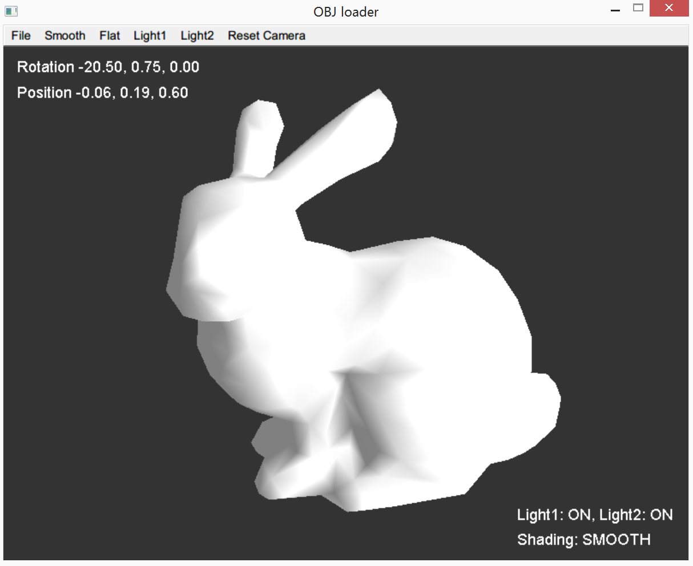
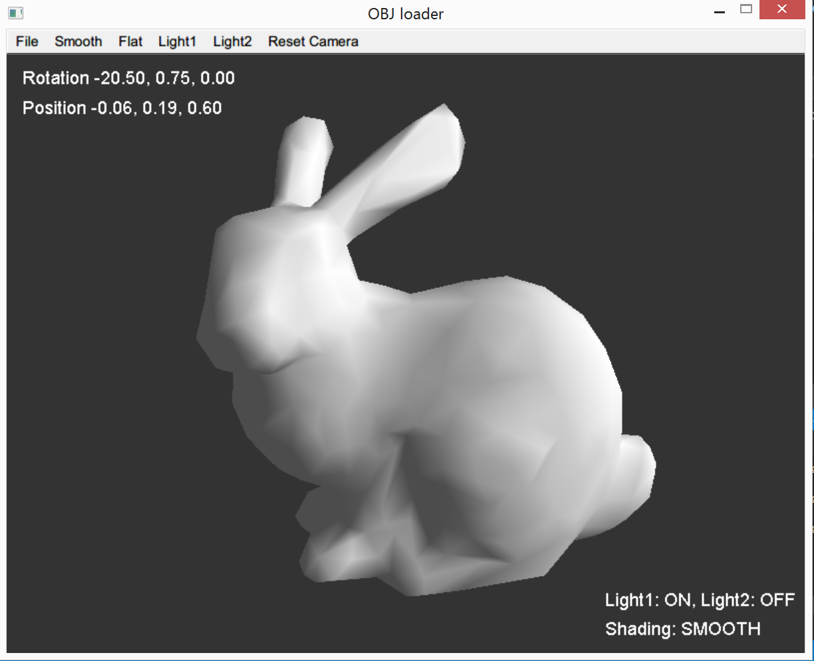
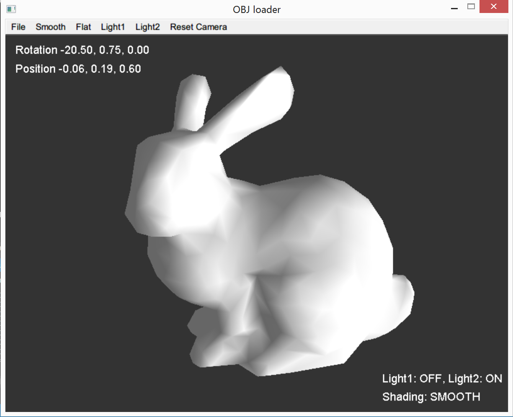
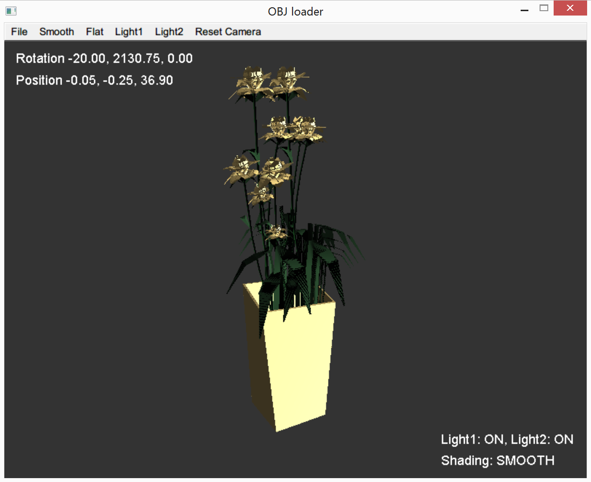
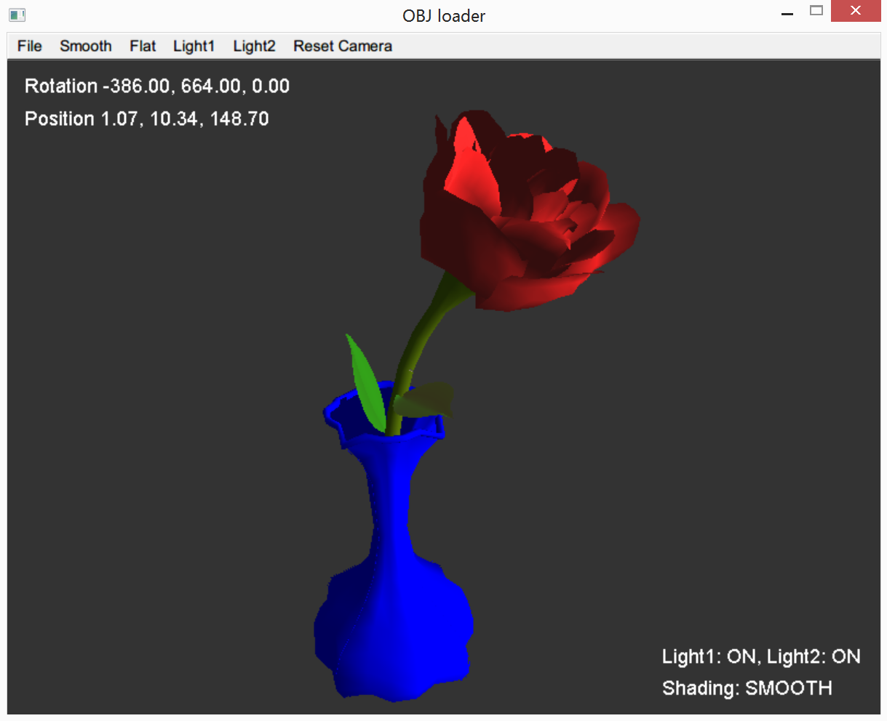
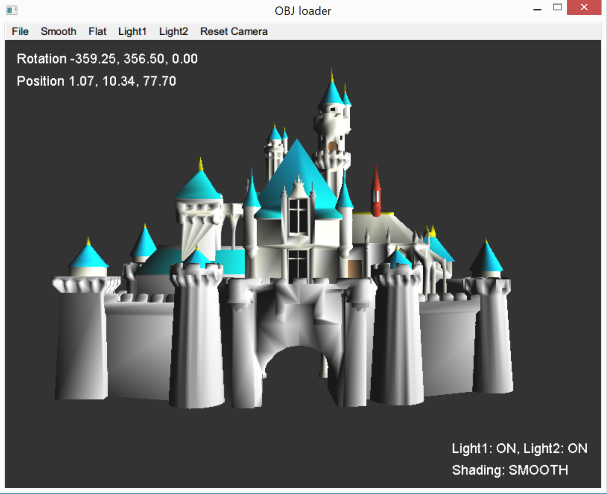
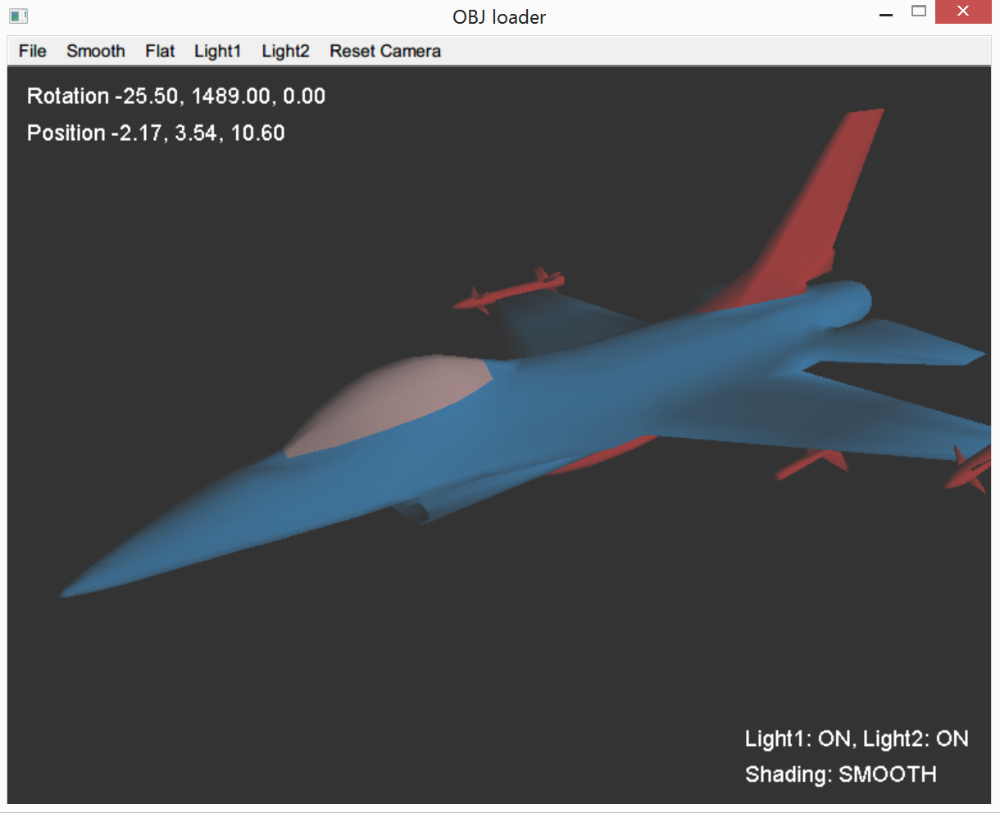

# Object Viewer

* Zhang Qiuyi, 12330402

## Dependencies

* glm(with some modification, included as source code)
* fltk(a win32 build is included)

## What is it?

A Wavefront .obj viwer, with .mtl support and GUI.



## Operations

### Menu

* `File/Open`: open a .obj file(it will automatically load related .mtl files)
* `File/Quit`: quit
* `Flat`: use flat shading
* `Smooth`: use smooth shading
* `Light1`: toggle light 1
* `Light2`: toggle light 2
* `Reset camera`: reset the camera(in case you get lost)

### Mouse drag

* Left button: rotate the object
* Middle button: translate the object
* Right button: zoom in/out on the object

Note: If you can't see the object after opening it, try using your mouse to adjust the camera. It may be that the object is too big/small or placed too far/close.

### Preview

Flat shading:


Light 1:



Light 2:



Flower:



Vase:



Castle:



F-16:



## File structure

```
  - doc  // report goes here
  - include  // header files
  - lib  // static libraries
  - data  // sample .obj and .mtl files
  - src  // source code
  - screenshots // screenshots

  // dynamic library for the prebuilt executable
  - freeglut.dll

  - hw4.sln   // VS2013 project file
  - hw4.exe  // prebuilt executable

  - README.md   // you are reading it :)
```

## About the executable

The executable `hw4.exe` is built for Windows with VS2013. If you have VS2013 installed(which means you have libraries like `msvcr120.dll` installed), you can run the executable directly. Otherwise you need to build it from source.

## How to build it?

If you are using VS2013, just open `hw4.sln` and build the `hw4` target. If you are using VS2015, you can try to do this too.

If you are using VS2012 or other versions of VS, follow this steps:

1. Create a new project from the existing code(make sure it's a console application instead of a windowed application), include all `.cpp` and `.h` files
2. Make sure VC++ will include `.\include` in its `INCLUDE` environment variable(e.g. Open `Properties -> Configuration Properties -> VC++ Directories -> Include Directories` and add `.\include`)
3. Make sure VC++ will include `.\lib` in its `INCLUDE` environment variable(e.g. Open `Properties -> Configuration Properties -> VC++ Directories -> Library Directories` and add `.\lib`)
4. The linker needs to link these libraries(e.g. Open `Properties -> Configuration Properties -> Linker -> Additional Dependencies` and add them):
  * `fltk.lib`
  * `fltkgl.lib`
  * `freeglut.lib`
  * `opengl32.lib`
  * `glu32.lib`
5. Make sure the executable will be output to the project directory(e.g. Open `Properties -> Configuration Properties -> General` and set `Output Directory` to `$(SolutionDir)\`).
6. Build the `hw4` target.

Warning: this program needs C++11 support(e.g. smart pointers), so an ancient VS might not be able to build it.

## Troubleshooting

If you can't build the program using the FLTK included in the project, you need to build it again. Follow the steps in [this link](https://bewuethr.github.io/installing-fltk-133-under-visual-studio/), and copy the `FL` folder(containing header files) into `include/`, and all built `.lib`s into `lib/`.
